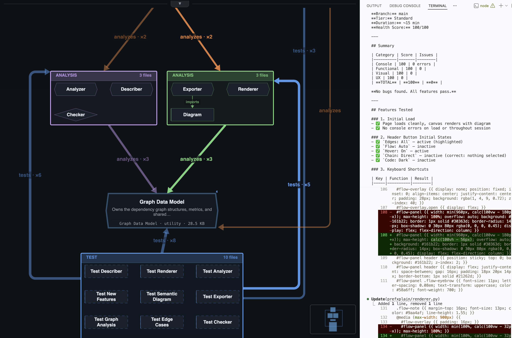
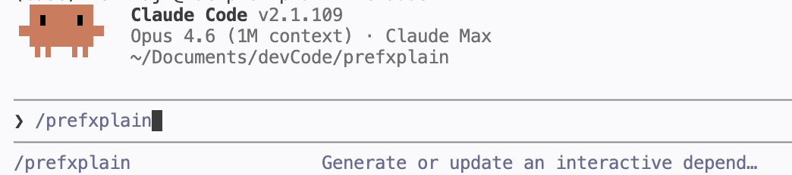
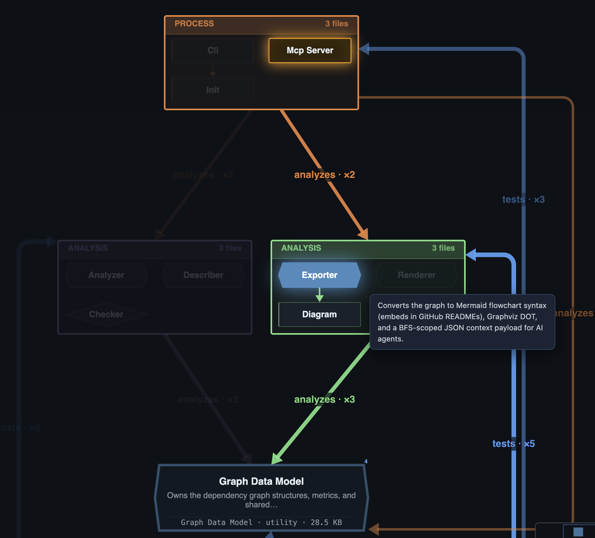
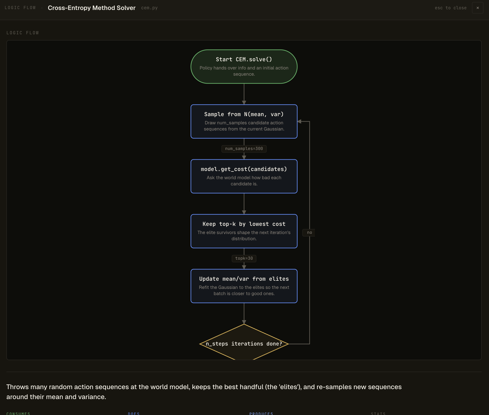

# PrefXplain

> **Claude Code ships a feature in 1 hour. Reviewing it takes me 5.**

That gap is the real bottleneck of AI-assisted software engineering, and
it's not going away. The more code your agent writes, the more your job
shifts from *writing* to *understanding* — understanding the architecture,
understanding what the agent just did, understanding what will break if
you let it ship.

Reading 40 diffs across 20 files is slow, painful, and doesn't scale. But
humans read pictures fast. Give me one good diagram and I'll grasp a
codebase in five minutes that would take me five hours of file-by-file
reading.

**PrefXplain is that diagram.** One slash-command inside Claude Code (or
Codex, or Cursor, or Windsurf) turns your repo into an interactive
architecture map — every file has a role, a plain-English description, and
a place in the dependency flow. No API key, no setup, no upload. Just a
single HTML file you can open, share, or drop into a deck.

**The goal isn't to replace reading code. It's to know what to read.**

I'm a founder shipping with Claude Code every day. I built PrefXplain
because I was drowning in review. Now I run `/prefxplain` before every
audit, every onboarding, every investor walkthrough. It takes 30 seconds
and it changes how I think about the codebase I'm steering.

Free. MIT. Fork it, improve it, make it yours.

**Who this is for:**
- **Founders** explaining their tech to non-technical stakeholders — investors, customers, new hires
- **Devs steering a coding agent** and tired of reviewing diffs blind
- **Tech leads onboarding onto a repo** they didn't write

**Lives inside your IDE.** `/prefxplain` opens the diagram in a preview tab right next to your agent — VS Code, Cursor, Windsurf, Antigravity, whatever. Architecture map on the left, Claude Code (or Codex) on the right. No window swapping, no context loss. (Prefer a browser? The HTML works standalone too.)

---

## See it



*PrefXplain on the left, Claude Code on the right. Architecture stays
visible while your agent codes. No alt-tab, no context loss.*

Every block is a file or an architectural group. Click to see the
description, the blast radius, the imports, and the actual logic as a
flowchart. Search matches descriptions, not just filenames. The whole
thing is one HTML file — offline, shareable, safe to send.

## Install — 30 seconds

**Requirements:** Python 3.10+, and one of:
- [Claude Code](https://docs.anthropic.com/en/docs/claude-code)
- [Codex CLI](https://github.com/openai/codex)
- [GitHub Copilot CLI](https://docs.github.com/copilot/concepts/agents/about-copilot-cli)

```bash
pipx install prefxplain && prefxplain setup
```

That's it. One command, installed globally, works from every project
forever. `pipx` keeps it in its own isolated environment so it never
conflicts with your project venvs. `prefxplain setup` registers PrefXplain
for Claude Code, Codex, Cursor/Windsurf, and Copilot CLI — whichever ones
you have installed.

> Don't have pipx? `brew install pipx` (macOS) or `python -m pip install --user pipx` (everywhere else). Or use plain `pip install prefxplain` inside a venv — you'll just have to repeat it per project.

## Use it — 1 line

Open your AI coding CLI (Claude Code, Codex, or Copilot) inside any repo and type:

```
/prefxplain
```



The agent reads your files, groups them into architectural blocks, writes
a short description for each, and opens an interactive diagram in an IDE
preview tab. First run on a medium repo: ~2 minutes. Re-runs: seconds
(descriptions are cached).

**No API key.** The agent runs inside your existing Claude Code, Codex, or Copilot
session, so you pay nothing extra — your subscription already covers it.
If you'd rather call a model directly (CI, automation, headless), set
`ANTHROPIC_API_KEY` or `OPENAI_API_KEY` and use the `prefxplain` CLI.

## What you get

- **Executive summary** — 3–5 sentences covering what the project does, its main layers, and its critical path. Paste it into a deck.
- **Health score (1–10)** with plain-English notes. *"No circular deps. `graph.py` is a single point of failure (13 of 17 files depend on it). Test coverage is solid."*
- **Layered architecture diagram** — files grouped into logical blocks (CLI, Analysis, Rendering, …), laid out by dependency depth.
- **Blast radius on click** — select any file and see every file that breaks if you change it, highlighted in amber.
- **Semantic search** — type `auth` or `database` and it matches descriptions, not just filenames.
- **Flowcharts** — double-click a file to see its real logic as a flowchart.



*Click any block: neighbors fade, dependency edges light up with labels,
and a hover reveals the plain-English description.*



*Double-click to see the actual control flow of a file — start, decisions,
steps, end. Not a generic diagram, the real shape of the code.*

Everything is in a single self-contained HTML file. No server, no CDN, no
JavaScript dependencies, no upload. Safe to share with anyone.

## CLI (optional)

If you don't use a coding agent, the CLI works standalone — set an API
key and run:

```bash
prefxplain create .                    # analyze + open
prefxplain update .                    # re-analyze, preserve descriptions
prefxplain create . --no-descriptions  # offline, no LLM, still useful
prefxplain check .                     # CI: fail on circular deps
prefxplain mcp .                       # MCP server for AI agents
```

For Copilot CLI specifically, you can force setup with:

```bash
prefxplain setup copilot
```

This installs a global Copilot plugin that provides both:
- a `/prefxplain` command
- a natural-language trigger for prompts like "map this codebase architecture".

<details>
<summary>Full flag reference</summary>

| Flag | Default | Description |
|---|---|---|
| `--output`, `-o` | `./prefxplain.html` | Output path |
| `--format` | `html` | `html`, `matrix`, `mermaid`, `dot` |
| `--no-descriptions` | false | Skip LLM step |
| `--api-key` | env | Override API key |
| `--model` | `gpt-4o-mini` | LLM model |
| `--max-files` | 500 | Analysis cap |
| `--force`, `-f` | false | Regenerate all descriptions |
| `--filter` | — | Glob filter (e.g. `src/**/*.py`) |
| `--focus` / `--depth` | — | Depth-limited view around a file |

</details>

## Supported languages

| Language | Parser | Status |
|---|---|---|
| Python | `ast` (built-in) | Stable |
| TypeScript / JavaScript | Regex + `tsconfig` path aliases | Stable |
| Go, Rust, Java, Kotlin, C/C++ | Regex | Best-effort |

First-class tree-sitter support for the regex-parsed languages is on the
roadmap.

## Development

```bash
git clone https://github.com/PrefOptimize/PrefXplain.git
cd prefxplain
python -m venv .venv && source .venv/bin/activate
pip install -e ".[dev]"
make test
```

## License

MIT. Free forever. Go build something.
