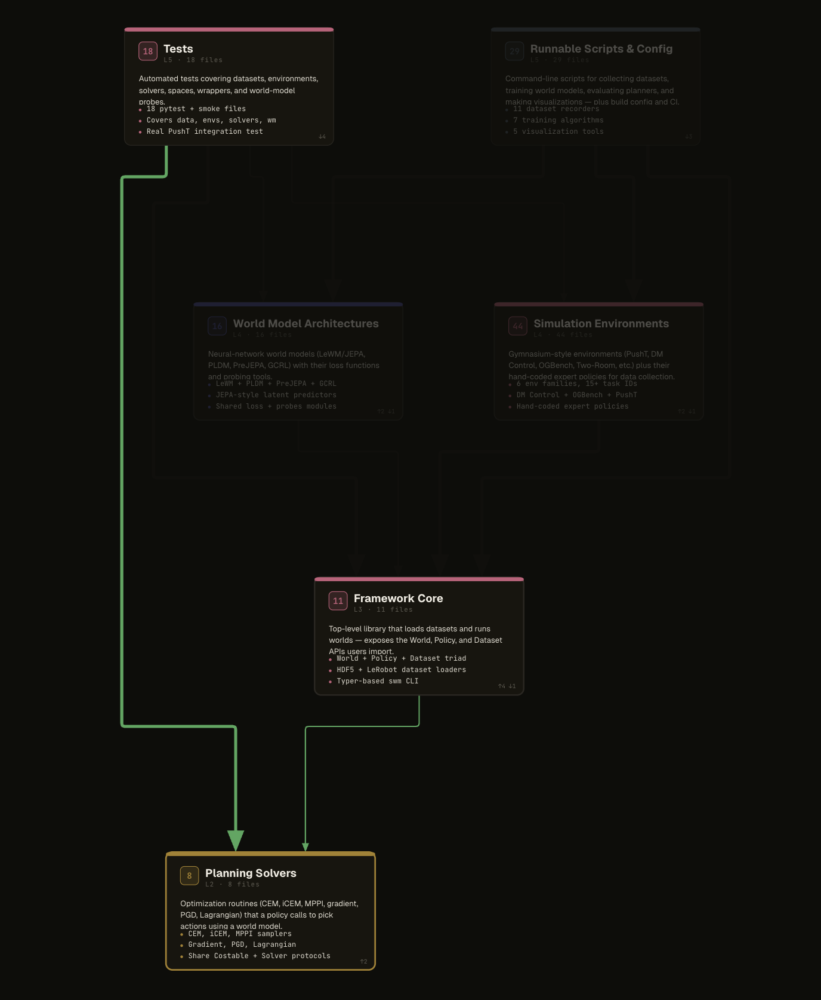
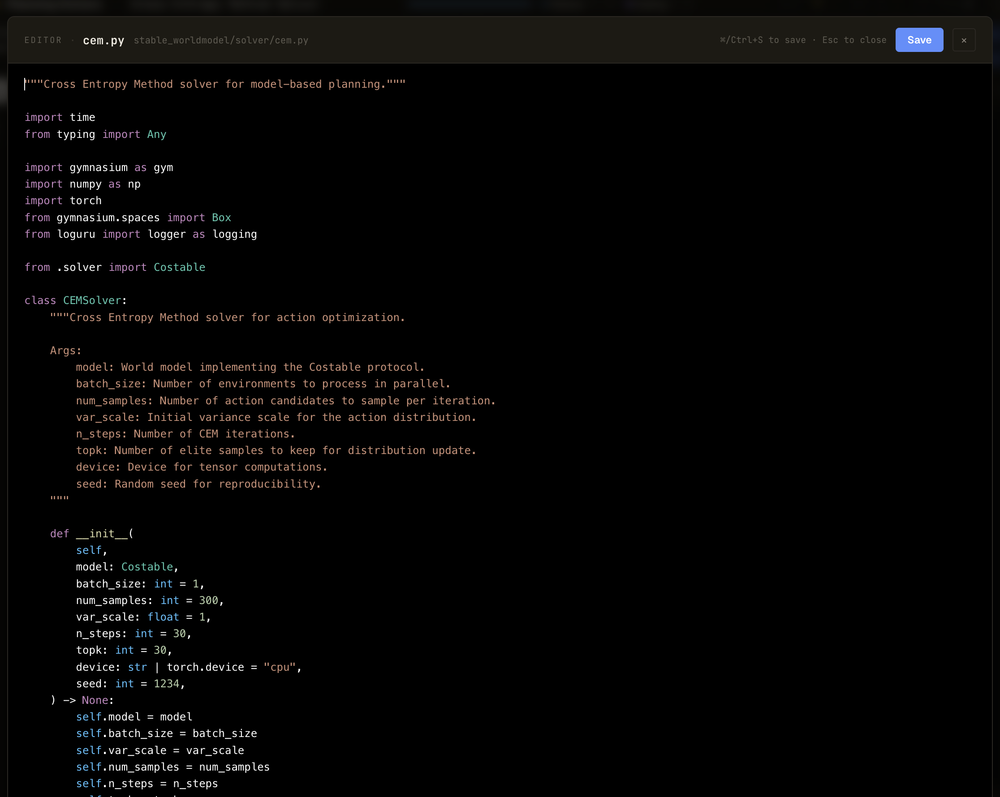

# PrefXplain

> **Claude Code ships a feature in 1 hour. Reviewing it takes me 5.**

That gap is the real bottleneck of AI-assisted software engineering. The more code
your agent writes, the more your job shifts from *writing* to *understanding* —
understanding the architecture, understanding what the agent just did, understanding
what will break if you let it ship. Reading 40 diffs across 20 files is slow, painful,
and doesn't scale.

- Runs 100% locally — no upload, no account
- No extra API cost — runs inside your existing AI coding tool session
- One command → one shareable offline HTML map · Free · Open source · Apache 2.0

**PrefXplain is that diagram.** One slash-command turns your repo into an interactive
architecture map — every file has a role, a plain-English description, and a place in
the dependency flow. I run `/prefxplain` before every audit, every onboarding, every
code review. 30 seconds. It changes how you think about the codebase you're steering.

**The goal isn't to replace reading code. It's to know what to read.**



*Every file gets a block, every dependency gets an edge. Click any block to see its
blast radius, double-click for the flowchart. One self-contained HTML file — offline,
shareable, no server.*

## Install — 30 seconds

Requires `git`, `python3 ≥ 3.9`, and any AI coding tool (Claude Code, Codex, Copilot, Gemini).

```bash
curl -fsSL https://raw.githubusercontent.com/PrefOptimize/PrefXplain/main/install.sh | bash
```

The installer sets everything up automatically — slash commands, IDE preview extension,
PATH entry. Re-run the same command to upgrade. For Codex (project-local), run
`prefxplain setup codex` inside each repo.

> **Inside your AI coding tool?** Paste the line above and the agent runs it for you.

## Use — 1 command

Open your AI coding tool inside any repo and type:

```
/prefxplain
```


The agent reads your files, groups them into architectural blocks, writes a short
description for each, and opens an interactive diagram in an IDE preview tab.
First run on a medium repo: ~2 minutes. Re-runs: seconds (descriptions are cached).

**No API key.** The agent runs inside your existing session — your subscription already
covers it. For CI or headless use, set `ANTHROPIC_API_KEY` or `OPENAI_API_KEY` and use
the `prefxplain` CLI.

## What you get

- **Executive summary** — 3–5 sentences covering what the project does, its main layers, and its critical path. Paste it into a deck.
- **Health score (1–10)** with plain-English notes. *"No circular deps. `graph.py` is a single point of failure (13 of 17 files depend on it). Test coverage is solid."*
- **Layered architecture diagram** — files grouped into logical blocks (CLI, Analysis, Rendering, …), laid out by dependency depth.
- **Blast radius on click** — select any file and see every file that breaks if you change it, highlighted in amber.
- **Semantic search** — type `auth` or `database` and it matches descriptions, not just filenames.
- **Flowcharts** — double-click a file to see its real logic as a flowchart.
- **Inline editor** — press Space on any block to open the source file without leaving the diagram.


*Double-click to see the actual control flow of a file — start, decisions, steps, end.
Not a generic diagram, the real shape of the code.*



*Press Space on any block to open the source file in an inline editor — read the code,
fix a bug, tweak a description — without leaving the diagram.*

Everything is in a single self-contained HTML file. No server, no CDN, no JavaScript
dependencies, no upload. Safe to share with anyone.

## Integrations

| Tool | `/prefxplain` | Setup |
|------|--------------|-------|
| Claude Code | Auto | Auto |
| GitHub Copilot CLI | Auto | Auto |
| Gemini CLI | Auto | Auto |
| Cursor / Windsurf | Auto | Auto |
| Codex | Auto | `prefxplain setup codex` (per-repo) |

## CLI (optional)

If you don't use a coding agent, the CLI works standalone — set an API key and run:

```bash
prefxplain create .                    # analyze + open
prefxplain update .                    # re-analyze, preserve descriptions
prefxplain create . --no-descriptions  # offline, no LLM, still useful
prefxplain check .                     # CI: fail on circular deps
prefxplain mcp .                       # MCP server for AI agents
prefxplain upgrade                     # pull the latest release from GitHub main
```

Force setup for a specific tool:

```bash
prefxplain setup copilot
prefxplain setup gemini
prefxplain setup claude-code
prefxplain setup cursor
prefxplain setup codex   # per-repo
```

<details>
<summary>Full flag reference</summary>

| Flag | Default | Description |
|---|---|---|
| `--output`, `-o` | `./prefxplain.html` | Output path |
| `--format` | `html` | `html`, `matrix`, `mermaid`, `dot` |
| `--no-descriptions` | false | Skip LLM step |
| `--api-key` | env | Override API key |
| `--model` | `gpt-4o-mini` | LLM model |
| `--max-files` | 500 | Analysis cap |
| `--force`, `-f` | false | Regenerate all descriptions |
| `--filter` | — | Glob filter (e.g. `src/**/*.py`) |
| `--focus` / `--depth` | — | Depth-limited view around a file |
| `--level`, `-l` | `newbie` | Audience voice: `newbie`, `middle`, `strong`, `expert` |

</details>

<details>
<summary>Update — 1 line</summary>

From inside any AI coding tool: `/prefxplain-update`

Or from any terminal: `prefxplain upgrade`

Both re-run the installer against GitHub `main` and re-register the slash commands.

</details>

## Supported languages

| Language | Parser | Status |
|---|---|---|
| Python | `ast` (built-in) | Stable |
| TypeScript / JavaScript | Regex + `tsconfig` path aliases | Stable |
| Go, Rust, Java, Kotlin, C/C++ | Regex | Best-effort |

First-class tree-sitter support for the regex-parsed languages is on the roadmap.

## FAQ

<details>
<summary>Does PrefXplain upload my code?</summary>

No. The dependency graph is built **locally** — Python AST for Python, regex + `tsconfig` parsing for TypeScript/JavaScript, regex for the rest. The optional LLM step sends only per-file signatures (path, imports, exports, a handful of top-level symbol names) to the model you already use; it never sends file contents. Run `prefxplain create . --no-descriptions` to skip the LLM step entirely and stay fully offline.

</details>

<details>
<summary>Does it work offline / without an API key?</summary>

Yes. `--no-descriptions` produces a full diagram — structure, blast radius, search — with zero network calls. When you *do* want descriptions, PrefXplain runs inside your existing AI coding tool session, so there's no extra billing. Only the standalone `prefxplain` CLI requires `ANTHROPIC_API_KEY` or `OPENAI_API_KEY`.

</details>

<details>
<summary>How is this different from CodeSee, Sourcegraph, or `tree`?</summary>

- **`tree` / `madge` / `pydeps`** show the shape of your codebase. PrefXplain adds plain-English descriptions, a layered layout, blast-radius on click, and per-file flowcharts.
- **Sourcegraph / CodeSee** are SaaS — they require an account, upload source to their servers, and cost money. PrefXplain is one offline HTML file, no account, Apache 2.0.
- PrefXplain is **agent-native**: a single slash command inside the AI coding tool you already use, not a separate UI.

</details>

<details>
<summary>How accurate are the AI-generated descriptions?</summary>

Good enough for navigation, not a substitute for reading the code. The LLM sees one file at a time plus its imports and exports, so descriptions are reliable for *what a file does* and less reliable for *subtle contract details*. Descriptions are cached and re-used across runs; `prefxplain update .` preserves them unless you pass `--force`.

</details>

<details>
<summary>Can I use PrefXplain in CI?</summary>

Yes. `prefxplain check .` exits non-zero on circular dependencies — drop it into a GitHub Action to fail the build when new cycles appear. For artifacts, `prefxplain create . --no-descriptions` generates an offline HTML diagram with no API calls, safe to upload as a CI artifact.

</details>

<details>
<summary>How is it different from a dependency graph I could generate myself?</summary>

`madge`, `pydeps`, and `import-linter` give you edges. PrefXplain adds a description per file, a layered layout that groups files by architectural role, blast-radius on click, per-file flowcharts, and semantic search across descriptions (not just filenames). The output is one self-contained HTML file — shareable, safe to drop into a deck.

</details>

## Development

```bash
git clone https://github.com/PrefOptimize/PrefXplain.git
cd prefxplain
python -m venv .venv && source .venv/bin/activate
pip install -e ".[dev]"
make test
```

## License

PrefXplain is licensed under the Apache License 2.0. The Apache 2.0 license keeps the
project fully open source and free for any use — commercial or personal — while
requiring that redistributions preserve the attribution notices in
[`LICENSE`](./LICENSE) and [`NOTICE`](./NOTICE).

---

Built by [Rémi Al Ajroudi](https://github.com/RemiAJR) — [LinkedIn](https://www.linkedin.com/in/remi-al-ajroudi/).
